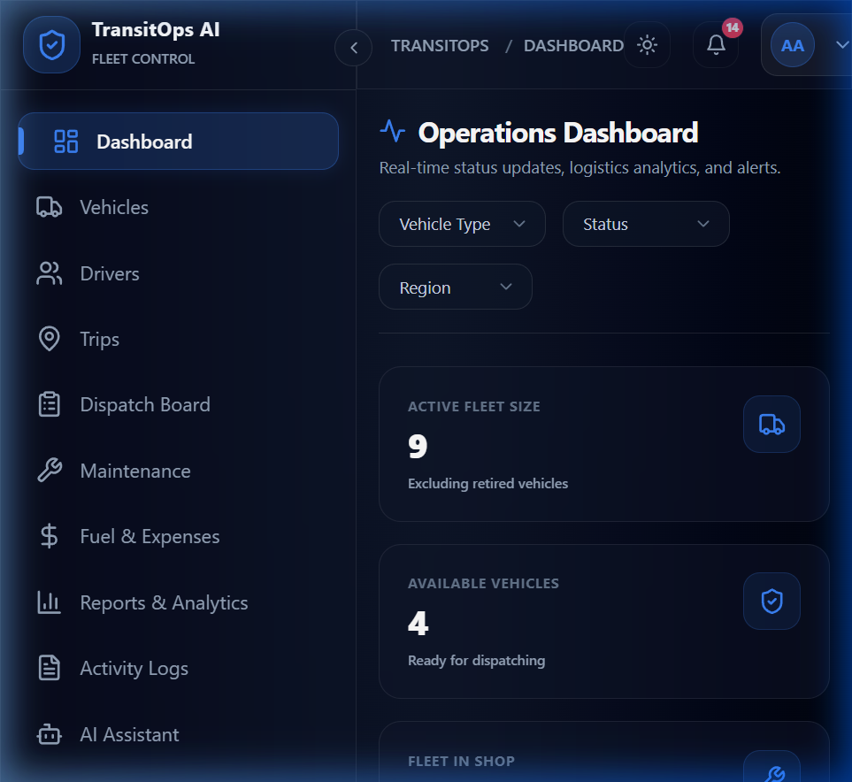
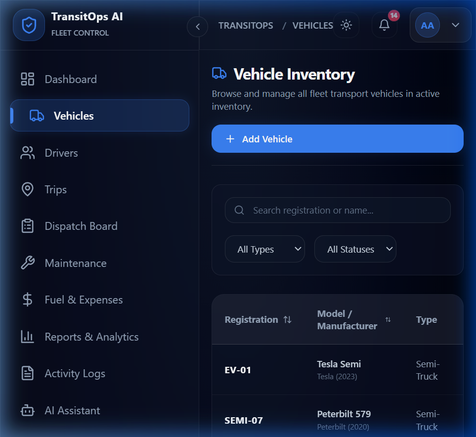
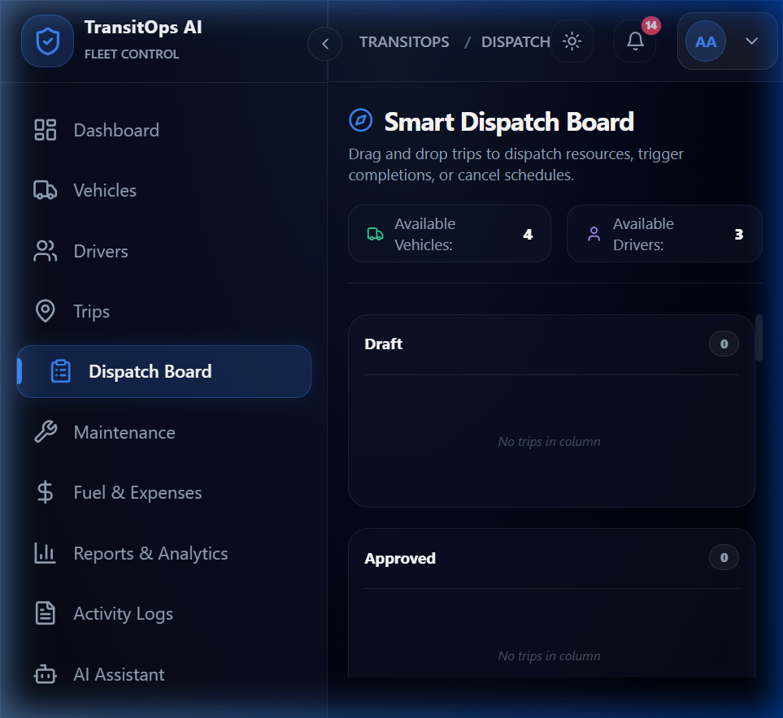
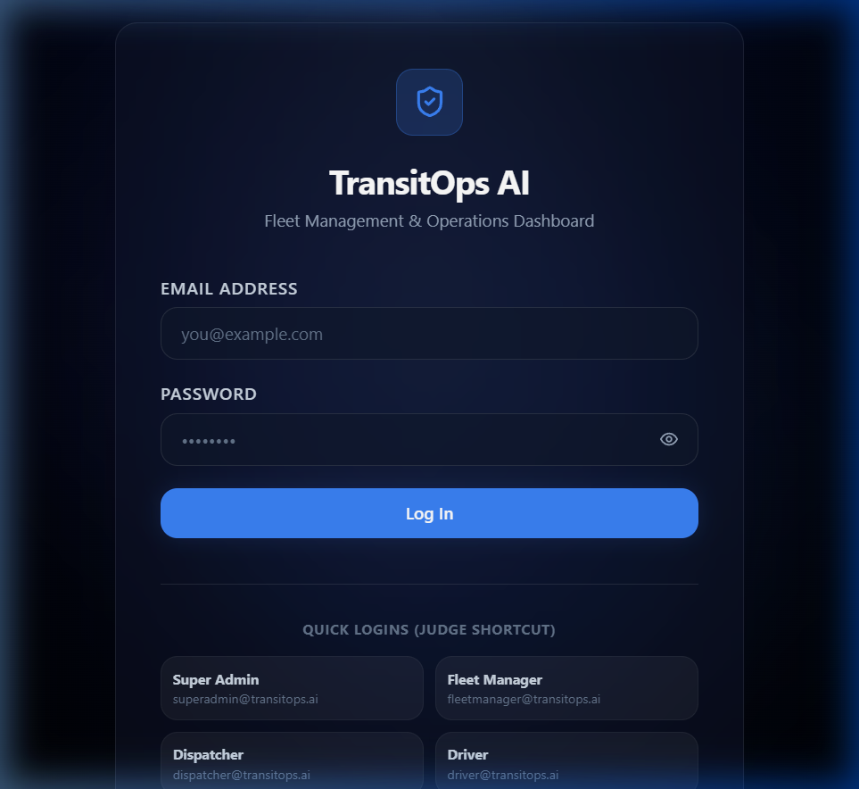

# 🚛 TransitOps AI

### Enterprise Smart Fleet & Transport Operations Platform

A complete Transport Management System (TMS) that digitizes the entire lifecycle of transport operations from vehicle registration to trip dispatch, maintenance, fuel tracking, and business intelligence built for **Odoo Hackathon 2026**.

<p align="left">
  <a href="https://transitops-ai-production.up.railway.app"></a>
</p>

<p align="left">
  
  
  
  
  
  
  
</p>

---

## 📸 Screenshots

<p align="center">
  
  
</p>
<p align="center">
  
  
</p>

---

## 📖 Table of Contents

- [Live Demo](#-live-demo)
- [Screenshots](#-screenshots)
- [Problem Statement](#-problem-statement)
- [Overview](#-overview)
- [Target Users](#-target-users)
- [Key Features](#-key-features)
- [Tech Stack](#-tech-stack)
- [System Architecture](#-system-architecture)
- [Database Schema](#-database-schema)
- [Business Rules](#-business-rules)
- [Getting Started](#-getting-started)
- [Environment Variables](#-environment-variables)
- [Demo Credentials](#-demo-credentials)
- [Project Structure](#-project-structure)
- [Example Workflow](#-example-workflow)
- [Roadmap](#-roadmap--module-status)
- [Known Limitations](#-known-limitations)
- [Contributing](#-contributing)
- [Team](#-team)
- [License](#-license)

---

## 🌐 Live Demo

> **🔗 [Open TransitOps AI →](https://transitops-ai-production.up.railway.app)**
>
> Log in with any of the [demo credentials](#-demo-credentials) below to explore the full platform.
>
> **Quick access:** Use `superadmin@transitops.ai` / `demo1234` for full access to all modules.

---

## 🎯 Problem Statement

Many logistics companies still rely on spreadsheets and manual logbooks to manage transport operations. This leads to scheduling conflicts, underutilized vehicles, missed maintenance, expired driver licenses, inaccurate expense tracking, and poor operational visibility.

**TransitOps AI** replaces the spreadsheet chaos with a single centralized platform that manages the complete lifecycle of transport operations — vehicle registration, driver management, dispatching, maintenance, fuel logging, expense tracking, and analytics — with automated business-rule enforcement and real-time insights.

---

## 🧭 Overview

TransitOps AI is designed to feel like **Power BI meets Odoo** — a modern, data-dense, enterprise-grade ERP experience with a glassmorphism design language, animated KPI dashboards, and role-based workflows for every stakeholder in a fleet operation.

---

## 👥 Target Users

| Role | Responsibility |
|---|---|
| **Fleet Manager** | Oversees fleet assets, maintenance, vehicle lifecycle, and operational efficiency |
| **Dispatcher** | Creates trips, assigns vehicles and drivers, monitors active deliveries |
| **Driver** | Views assigned trips, updates trip status, logs fuel |
| **Safety Officer** | Ensures driver compliance, tracks license validity, monitors safety scores |
| **Financial Analyst** | Reviews operational expenses, fuel consumption, maintenance costs, and profitability |
| **Maintenance Manager** | Manages service records, workshop scheduling, and repair costs |
| **Super Admin** | Full system access and configuration |
| **Viewer** | Read-only access for stakeholders |

---

## ✨ Key Features

### 🔐 Authentication & RBAC
Secure JWT-based login, role-based module visibility, session management, and profile/avatar management.

### 📊 Dashboard
Real-time KPI cards (Fleet Utilization, Active Trips, Vehicles in Maintenance, Revenue, ROI), interactive charts (fleet trends, cost breakdowns, trip completion rates), and a live activity feed.

### 🚚 Vehicle Management
Full vehicle registry with unique registration enforcement, document uploads (Insurance, PUC, Fitness Certificate, Permit), depreciation tracking, and lifecycle status management.

### 👤 Driver Management
Driver profiles with license tracking, automatic expiry alerts, safety scoring, and status-based assignment eligibility.

### 🗺️ Trip Management
End-to-end trip lifecycle (`Draft → Dispatched → Completed / Cancelled`) with automated vehicle/driver status transitions and full validation against business rules.

### ⚡ Smart Dispatch Board
Kanban-style drag-and-drop dispatch board with live availability indicators.

### 🔧 Maintenance Management
Service record tracking with automatic vehicle status changes (`Available ↔ In Shop`).

### ⛽ Fuel & Expense Management
Fuel logs with auto-computed efficiency, categorized expense tracking linked to vehicles, trips, and drivers.

### 📈 Reports & Analytics
Fuel efficiency, fleet utilization, operational cost, and **Vehicle ROI** reports with CSV export.

### 🔔 Notifications
Automated alerts for license expiry, insurance expiry, upcoming maintenance, and trip assignments.

### 🤖 AI Fleet Assistant
Natural-language chat interface to query live fleet data — *"Which vehicles need maintenance next week?"*, *"Show drivers with expired licenses"*, *"Which vehicle has the lowest ROI?"*

---

## 🛠️ Tech Stack

| Layer | Technologies |
|---|---|
| **Frontend** | React 18, TypeScript, Vite, Tailwind CSS, TanStack Query, React Router, React Hook Form, Zod, Recharts, Framer Motion |
| **Backend** | Node.js, Express, TypeScript, Zod, JWT, bcrypt, Multer |
| **Database & ORM** | SQLite, Prisma ORM |
| **Deployment** | Railway (monolith — server serves built frontend) |
| **Styling & Icons** | Tailwind CSS, Lucide React |

---

## 🏗️ System Architecture

```
┌─────────────────────┐      HTTP Requests      ┌───────────────────────────┐
│     Vite React      │ ──────────────────────→ │    Node Express Server    │
│  (client, port 5173)│ ←────────────────────── │  (server, port 3000)      │
└─────────────────────┘   JWT (httpOnly cookie)  └──────────┬───────────────┘
                                                            │
                                                      Prisma ORM
                                                            │
                                                 ┌──────────▼───────────┐
                                                 │       SQLite          │
                                                 └──────────────────────┘
```

- **Monorepo** with independent `/client` and `/server` packages
- **Stateless auth** via JWT stored in httpOnly, sameSite cookies
- **Transactional business logic** — all status transitions (dispatch, complete, maintenance) run as atomic Prisma transactions to prevent race conditions
- **Production**: Server serves the pre-built React frontend as static files with SPA catch-all routing

---

## 🗄️ Database Schema

| Entity | Description |
|---|---|
| `Role` | User roles with permissions (Super Admin, Fleet Manager, etc.) |
| `User` | Login credentials, role, profile, avatar |
| `ActivityLog` | Full audit trail of user actions |
| `Vehicle` | Registry, documents, status, financials |
| `Driver` | Profile, license, safety score, status |
| `Trip` | Lifecycle, cargo, assigned vehicle/driver, timeline |
| `MaintenanceRecord` | Service records linked to vehicles |
| `FuelLog` | Fuel entries linked to vehicle/driver |
| `Expense` | Categorized costs linked to vehicle/trip/driver |
| `Notification` | System and compliance alerts |

> Full schema definitions live in [`/server/prisma/schema.prisma`](./server/prisma/schema.prisma)

---

## ⚖️ Business Rules

TransitOps AI enforces the following rules at the **database and API level** (not just UI validation):

1. ✅ Vehicle registration numbers must be unique.
2. 🚫 Retired or In Shop vehicles never appear in dispatch selection.
3. 🚫 Drivers with expired licenses or Suspended status cannot be assigned to trips.
4. 🚫 A vehicle or driver already On Trip cannot be assigned to another trip.
5. ⚖️ Cargo weight must not exceed the assigned vehicle's maximum load capacity.
6. 🔄 Dispatching a trip automatically sets both vehicle and driver to `On Trip`.
7. ✔️ Completing a trip automatically restores both to `Available`.
8. ↩️ Cancelling a dispatched trip restores both to `Available`.
9. 🔧 Creating an active maintenance record automatically sets vehicle status to `In Shop`.
10. 🏁 Closing maintenance restores the vehicle to `Available` (unless Retired).

---

## 🚀 Getting Started

### Prerequisites
- **Node.js** ≥ 18
- **npm** or **pnpm**
- **Git**

### 1. Clone the repository
```bash
git clone https://github.com/nandishpatel4647/TransitOps_AI.git
cd TransitOps_AI
```

### 2. Backend setup
```bash
cd server
npm install
cp .env.example .env  # Configure environment variables
npx prisma migrate dev
npx prisma db seed
npm run dev
```
Server runs at `http://localhost:3000`

### 3. Frontend setup
```bash
cd ../client
npm install
npm run dev
```
Client runs at `http://localhost:5173`

### 4. Open the app
Navigate to `http://localhost:5173` and log in using any of the [demo credentials](#-demo-credentials) below.

> **Or try the live deployment → [TransitOps AI](https://transitops-ai-production.up.railway.app)**

---

## 🔧 Environment Variables

Copy `.env.example` to `.env` inside the `/server` directory and configure:

| Variable | Required | Default | Description |
|---|---|---|---|
| `PORT` | No | `3000` | Server port (Railway sets this automatically) |
| `JWT_SECRET` | **Yes** | — | Secret key for signing JWT tokens. Use a strong random string in production |
| `DATABASE_URL` | **Yes** | `file:./dev.db` | Prisma connection string. SQLite for dev, PostgreSQL for production |
| `NODE_ENV` | No | `development` | Set to `production` to serve the built React frontend from the server |
| `CORS_ORIGIN` | No | — | Additional allowed CORS origin (not needed in production monolith mode) |

---

## 🔑 Demo Credentials

All seeded accounts use the password: **`demo1234`**

| Role | Email | Permissions / Gating |
|---|---|---|
| **Super Admin** | `superadmin@transitops.ai` | Read/write access to all screens, database logs |
| **Fleet Manager** | `fleetmanager@transitops.ai` | Access to Vehicles, Drivers, Trips, Reports, Logs |
| **Dispatcher** | `dispatcher@transitops.ai` | Access to Vehicles, Trips, Dispatch board |
| **Safety Officer** | `safety@transitops.ai` | Access to Driver profiles, safety scores |
| **Financial Analyst** | `finance@transitops.ai` | Access to Expenses, Reports, ROI analytics |
| **Maintenance Manager** | `maintenance@transitops.ai` | Access to Maintenance logs, shop schedules |
| **Driver** | `driver@transitops.ai` | Access to assigned trips, fuel log entries |
| **Viewer** | `viewer@transitops.ai` | Read-only access across the dashboard metrics |

---

## 📁 Project Structure

```
TransitOps_AI/
├── client/                 # React + TypeScript frontend
│   ├── src/
│   │   ├── components/     # Sidebar, Navbar, Toast
│   │   ├── context/        # AuthContext (JWT session)
│   │   ├── lib/            # Axios API client
│   │   ├── pages/          # Login, Dashboard, Vehicles, Drivers, Trips...
│   │   └── App.tsx         # Route definitions & RBAC guards
│   ├── vite.config.ts
│   └── package.json
├── server/                 # Node + Express + TypeScript backend
│   ├── prisma/
│   │   ├── schema.prisma   # Database schema
│   │   ├── migrations/     # Prisma migration history
│   │   └── seed.ts         # Demo data seeder
│   ├── src/
│   │   ├── middleware/      # auth.ts (JWT + RBAC middleware)
│   │   ├── routes/          # API route handlers
│   │   └── index.ts         # Express app entry point
│   ├── uploads/             # Uploaded documents & avatars
│   └── package.json
├── docs/
│   └── screenshots/         # App screenshots for README
├── package.json             # Root monorepo scripts
├── railway.json             # Railway deployment config
├── Procfile
├── LICENSE                  # MIT License
└── README.md
```

---

## 🔁 Example Workflow

1. Register vehicle `Van-05` — max capacity 500 kg, status `Available`
2. Register driver `Alex` with a valid license
3. Create a trip with cargo weight `450 kg`
4. System validates `450 kg ≤ 500 kg` → dispatch allowed
5. Vehicle and driver status automatically become `On Trip`
6. Complete the trip — enter final odometer and fuel consumed
7. Vehicle and driver automatically return to `Available`
8. Create a maintenance record (e.g., Oil Change) — vehicle automatically becomes `In Shop` and is hidden from dispatch
9. Reports update operational cost and fuel efficiency based on the latest data

---

## 🗺️ Roadmap / Module Status

| # | Module | Status |
|---|---|---|
| 1 | Auth, RBAC & Scaffold | ✅ Complete |
| 2 | Dashboard | ✅ Complete |
| 3 | Vehicle Management | ✅ Complete |
| 4 | Driver Management | ✅ Complete |
| 5 | Trip Management | ✅ Complete |
| 6 | Smart Dispatch Board | ✅ Complete |
| 7 | Maintenance Management | ✅ Complete |
| 8 | Fuel & Expense Tracking | ✅ Complete |
| 9 | Reports & Analytics | ✅ Complete |
| 10 | Notifications | ✅ Complete |
| 11 | AI Fleet Assistant | ✅ Complete |
| 12 | Production Deployment | ✅ Complete |

---

## ⚠️ Known Limitations

- Built with SQLite for hackathon speed; schema is Postgres-ready via a single `DATABASE_URL` swap.
- Forgot Password / Email Verification flows are intentionally excluded — seeded demo accounts are used instead.
- AI Assistant uses a lightweight intent-matching engine rather than a full LLM integration in the base build.
- File uploads are stored locally (`/uploads`), not on cloud storage, for this build.

---

## 🤝 Contributing

Contributions are welcome! Here's how to get started:

1. **Fork** the repository
2. **Create** a feature branch: `git checkout -b feature/my-feature`
3. **Commit** your changes: `git commit -m 'feat: add my feature'`
4. **Push** to the branch: `git push origin feature/my-feature`
5. **Open** a Pull Request

Please follow the [Conventional Commits](https://www.conventionalcommits.org/) specification for commit messages.

---

## 👨‍💻 Team

| Name | Role |
|---|---|
| Nandish Patel | Frontend Developer |
| Krina Suthar | Full Stack Developer |
| Arnob Maity | Full Stack Developer |

---

## 📄 License

This project was built for **Odoo Hackathon 2026** and is provided under the [MIT License](./LICENSE).

---

<p align="center">Built with ⚡ for Odoo Hackathon 2026</p>
